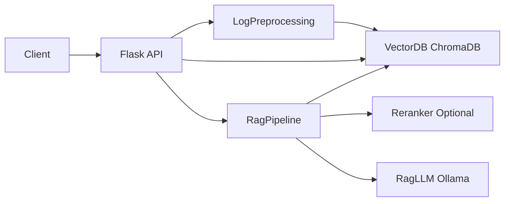
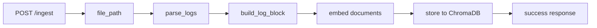
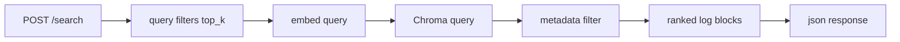
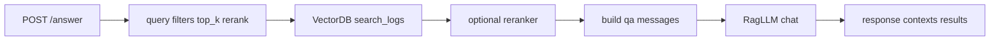

## LoggingFlask

基于 Flask + ChromaDB + 本地 LLM 的日志 RAG 项目，当前已具备三条核心能力：

- `ingest`：日志预处理并入库
- `search`：日志语义检索
- `answer`：检索增强问答

适用场景：
- 查询某个 `reqId` 的异常链路
- 根据自然语言检索相关日志块
- 基于召回结果生成简要故障说明

## 项目架构




## 核心模块说明

- `apps/appLog.py`  
  Flask 服务入口，暴露 `/ingest`、`/search`、`/answer`

- `modules/LogPreprocessing.py`  
  按 `reqId` 聚合日志，提取 `timestamp / level / service / message`，构建日志块

- `modules/VectorDB.py`  
  负责日志块 embedding、ChromaDB 持久化存储、语义检索与元数据过滤

- `modules/RagPipeline.py`  
  串联检索、可选重排、Prompt 构造和 LLM 生成

- `modules/RagLLM.py`  
  通过 Ollama 的 OpenAI 兼容接口调用本地模型

- `modules/Reranker.py`  
  可选重排序模块，用于优化 Top-K 结果排序

## 三个主要端点

### 1. `/ingest`

作用：将日志文件解析后写入向量库。

请求示例：

```json
{
  "file_path": "/path/to/sample_logs.log"
}
```

处理链路：



逻辑说明：
- 读取日志文件
- 按 `reqId` 分组
- 提取元数据并生成 `text_for_embedding`
- 计算向量并写入 ChromaDB

### 2. `/search`

作用：根据自然语言查询返回相关日志块，不生成最终答案。

请求示例：

```json
{
  "query": "哪些请求出现了 DB timeout？",
  "top_k": 5,
  "filters": {
    "service": "UserService"
  }
}
```

处理链路：



逻辑说明：
- 将 `query` 转为向量
- 在 ChromaDB 中做相似度检索
- 按 `service` / `start_time` 做元数据过滤
- 返回 `text / score / metadata`

### 3. `/answer`

作用：执行完整 RAG 链路，返回基于日志上下文生成的回答。

请求示例：

```json
{
  "query": "req-123 发生了什么错误？",
  "top_k": 5,
  "filters": {
    "service": "UserService"
  },
  "rerank": false
}
```

处理链路：



逻辑说明：
- 先复用检索链路召回相关日志块
- 可选使用 `Reranker` 重排结果
- 将检索结果拼成上下文 Prompt
- 调用本地 LLM 生成回答
- 返回：
  - `response`
  - `retrieved_contexts`
  - `results`

## 日志格式

当前日志解析依赖以下格式：

```text
[2023-10-25 14:30:12,456] [INFO] [reqId:req-123] UserService: Request received from user-456
[2023-10-25 14:30:12,567] [DEBUG] [reqId:req-123] DB: Querying user profile...
[2023-10-25 14:30:12,789] [ERROR] [reqId:req-123] UserService: DB timeout! Failed to get user.
[2023-10-25 14:30:13,001] [INFO] [reqId:req-124] PaymentService: Starting payment for order-789
```

其中关键字段为：
- `timestamp`
- `level`
- `reqId`
- `service`
- `message`

